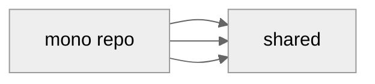

### Scaffold a mono repo

```bash
npm init -y -w packages/plugin1 -w packages/plugin2 -w packages/shared
```


```mermaid
%%{init: {'theme': 'neutral' } }%%
graph LR
A[mono repo] --> B[plugin1]
A[mono repo] --> B[plugin2]
A[mono repo] --> B[shared]
```
